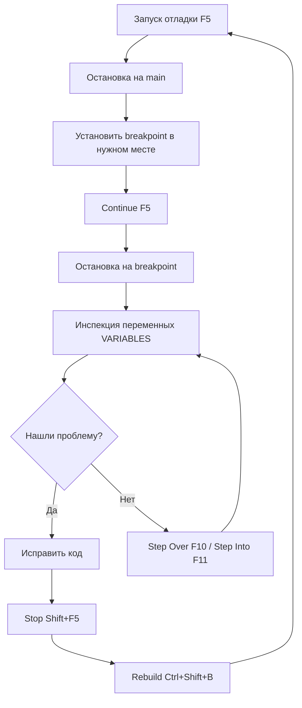

# 🐛 Руководство по отладке STM32 с Cortex-Debug

Полное руководство по отладке проекта F411CE в VS Code с расширением Cortex-Debug — от основ до продвинутых техник.

---

## 📋 Содержание

1. [Что такое отладка](#что-такое-отладка)
2. [Интерфейс Cortex-Debug](#интерфейс-cortex-debug)
3. [Первый запуск отладки](#первый-запуск-отладки)
4. [Основы работы с отладчиком](#основы-работы-с-отладчиком)
5. [Точки останова (Breakpoints)](#точки-останова-breakpoints)
6. [Пошаговое выполнение](#пошаговое-выполнение)
7. [Просмотр переменных](#просмотр-переменных)
8. [Стек вызовов](#стек-вызовов)
9. [Регистры и периферия](#регистры-и-периферия)
10. [Отладка FreeRTOS](#отладка-freertos)
11. [Типичные сценарии отладки](#типичные-сценарии-отладки)
12. [SWO трассировка](#swo-трассировка)
13. [Горячие клавиши](#горячие-клавиши)
14. [Troubleshooting](#troubleshooting)

---

## Что такое отладка

**Отладка (debugging)** — процесс поиска и исправления ошибок в программе путём пошагового выполнения кода и анализа состояния программы в реальном времени.

### Зачем нужна отладка?

В встраиваемых системах (STM32) отладка позволяет:
- 🔍 **Найти причину зависания** (hardfault, assert, infinite loop)
- 📊 **Проверить значения переменных** в runtime
- 🎯 **Понять логику работы** сложного кода
- ⚡ **Отследить выполнение** прерываний и RTOS задач
- 🧪 **Протестировать периферию** (GPIO, UART, SPI, etc.)

### Альтернатива: отладка printf

❌ **Плохо**:
```c
printf("value = %d\n", value);  // Медленно, засоряет код
HAL_Delay(1000);                // Искажает реальное поведение
```

✅ **Хорошо**: использовать отладчик для инспекции переменных без изменения кода.

---

## Интерфейс Cortex-Debug

После запуска отладки (F5) в VS Code появляются новые панели:

### Панель Debug (слева)

```
┌─────────────────────────────────┐
│ 🔍 VARIABLES                    │  ← Локальные и глобальные переменные
│   ├─ Local                      │
│   └─ Global                     │
├─────────────────────────────────┤
│ 👁️ WATCH                        │  ← Выражения для отслеживания
│   └─ <add expression>           │
├─────────────────────────────────┤
│ 📞 CALL STACK                   │  ← Стек вызовов функций
│   └─ main() main.c:479          │
├─────────────────────────────────┤
│ 🔴 BREAKPOINTS                  │  ← Список точек останова
│   └─ main.c:102                 │
├─────────────────────────────────┤
│ 🧵 CORTEX REGISTERS             │  ← Регистры ARM Cortex-M4
├─────────────────────────────────┤
│ 💾 CORTEX PERIPHERALS           │  ← Периферия STM32 (SVD)
└─────────────────────────────────┘
```

### Панель управления отладкой (вверху)

```
┌──────────────────────────────────────────────┐
│  ▶️ Continue  ⏸️ Pause  🔄 Restart  ⏹️ Stop   │
│  ⤵️ Step Over  ⬇️ Step Into  ⬆️ Step Out     │
└──────────────────────────────────────────────┘
```

---

## Первый запуск отладки

### Подготовка

1. **Подключите ST-Link** к ПК и плате BlackPill
2. **Соберите проект**: `Ctrl+Shift+B` (или сборка произойдёт автоматически)
3. **Убедитесь**, что плата запитана (3.3V)

### Запуск

1. Откройте файл `Core/Src/main.c`
2. Нажмите **F5** (или откройте вкладку Run and Debug → Debug (OpenOCD))

**Что произойдёт:**
```
1. VS Code соберёт проект (make -C Debug all)
2. OpenOCD прошьёт .elf в контроллер
3. Программа остановится на функции main()
4. Откроется панель отладки
```

### Первая остановка

По умолчанию программа остановится в начале `main()`:

```c
int main(void) {
  /* USER CODE BEGIN 1 */
  last_rx_time = 0;  ← Программа остановится здесь
```

**Жёлтая подсветка** показывает текущую строку выполнения.

---

## Основы работы с отладчиком

### 1. Continue (Продолжить) — F5

▶️ Продолжает выполнение программы до следующей точки останова или бесконечно.

**Когда использовать:** после инспекции переменных, чтобы продолжить работу программы.

### 2. Pause (Пауза) — F6

⏸️ Приостанавливает выполнение программы в текущем месте.

**Когда использовать:** если программа зависла в бесконечном цикле, чтобы понять, где она находится.

### 3. Restart (Перезапуск) — Ctrl+Shift+F5

🔄 Перезапускает отладку с начала (reset + halt на main).

### 4. Stop (Остановка) — Shift+F5

⏹️ Завершает сессию отладки и отключается от контроллера.

---

## Точки останова (Breakpoints)

**Breakpoint** — метка в коде, где отладчик остановит выполнение программы.

### Как установить breakpoint

1. **Клик на номере строки** (слева от кода) — появится красная точка 🔴
2. Или установите курсор на строку и нажмите **F9**

**Пример:**
```c
void StartDefaultTask(void *argument) {
  printf_uart3("Default Task running...\r\n");
  uint32_t diag_divider = 0;
  for (;;) {
    vTaskDelay(pdMS_TO_TICKS(1000));  🔴 ← Breakpoint здесь
    printf_uart3("Tick:%lu\r\n", HAL_GetTick());
    // ...
  }
}
```

Теперь каждую секунду программа будет останавливаться на этой строке.

### Типы breakpoints

#### 1. Обычный breakpoint
Останавливается каждый раз при достижении строки.

#### 2. Conditional breakpoint (условный)
Останавливается только при выполнении условия.

**Как создать:**
1. ПКМ на красной точке → Edit Breakpoint
2. Введите условие, например: `diag_divider == 3`

**Пример:**
```c
if (++diag_divider >= 5) {  🔴 Условие: diag_divider == 5
  diag_divider = 0;
```

Остановится только когда `diag_divider` равен 5.

#### 3. Logpoint (точка логирования)
Выводит сообщение в Debug Console без остановки программы.

**Как создать:**
1. ПКМ на номере строки → Add Logpoint
2. Введите: `Tick: {HAL_GetTick()}`

### Управление breakpoints

**Панель BREAKPOINTS** (левая часть):
- ☑️ Чекбокс — временно включить/выключить
- 🗑️ Правый клик → Remove — удалить
- 🚫 Remove All — удалить все

---

## Пошаговое выполнение

### Step Over (F10) — Шаг через

⤵️ Выполняет **текущую строку** и останавливается на следующей.

**Когда использовать:** чтобы идти по коду построчно, не заходя в функции.

**Пример:**
```c
vTaskDelay(pdMS_TO_TICKS(1000));          ← Курсор здесь
printf_uart3("Tick:%lu\r\n", HAL_GetTick());  ← F10 → переместится сюда
```

### Step Into (F11) — Шаг внутрь

⬇️ **Заходит внутрь функции** на текущей строке.

**Когда использовать:** чтобы понять, что происходит внутри функции.

**Пример:**
```c
fram_read(&fram, 0x0150, (uint8_t *)rd_data, sizeof(wr_data));  ← Курсор здесь
```

Нажмите **F11** → отладчик перейдёт в функцию `fram_read()` в файле `fram.c`.

### Step Out (Shift+F11) — Шаг наружу

⬆️ Выполняет оставшуюся часть функции и возвращается к вызывающему коду.

**Когда использовать:** случайно зашли в функцию и хотите вернуться.

### Step Back (не поддерживается в Cortex-Debug)

⚠️ В отличие от десктопных отладчиков, **нельзя вернуться назад** в STM32.

---

## Просмотр переменных

### Панель VARIABLES

Автоматически показывает все доступные переменные в текущей области видимости.

**Пример при остановке в `StartDefaultTask()`:**

```
🔍 VARIABLES
  ├─ Local
  │   ├─ argument = 0x00000000
  │   ├─ diag_divider = 3
  │   ├─ free_heap = 5960
  │   └─ min_heap = 5960
  └─ Global
      ├─ huart1 = {...}
      ├─ fram = {...}
      └─ uartQueue = 0x20000abc
```

### Раскрытие структур

Кликните на **▶️** рядом со структурой, чтобы увидеть её поля:

```
├─ fram = {...}
│   ├─ i2c = 0x00000000
│   ├─ cs_port = GPIOA
│   ├─ cs_pin = 4
│   └─ cfg = {...}
```

### Изменение значений (во время отладки!)

1. **ПКМ на переменной** → Set Value
2. Введите новое значение, например: `10`

**Пример:**
```c
uint32_t diag_divider = 0;  // Было 0
```

Измените на `4` → следующая итерация сразу выведет диагностику.

⚠️ **Важно:** изменения применяются только в RAM, не в Flash. После reset всё вернётся.

---

## Просмотр выражений (WATCH)

**WATCH** — отслеживание произвольных выражений.

### Как добавить выражение

1. Панель **WATCH** → нажмите **+**
2. Введите выражение, например:
   - `diag_divider * 2`
   - `free_heap + min_heap`
   - `huart1.Instance == USART1`
   - `(char*)uart1_rx_buf`

**Результат:**
```
👁️ WATCH
  ├─ diag_divider * 2 = 6
  ├─ free_heap + min_heap = 11920
  └─ (char*)uart1_rx_buf = "Hello"
```

### Преобразование типов

Чтобы посмотреть массив байт как строку:
```
(char*)uart1_rx_buf
```

Чтобы посмотреть указатель как массив:
```
*(uint8_t[10]*)buffer
```

---

## Стек вызовов

**CALL STACK** показывает цепочку вызовов функций, приведших к текущей точке.

**Пример:**
```
📞 CALL STACK
  ├─ fram_read() [fram.c:45]          ← Текущая функция
  ├─ Uart1Task() [main.c:149]         ← Вызвана из Uart1Task
  ├─ vPortTaskWrapper() [port.c:217]  ← Обёртка FreeRTOS
  └─ <signal handler>                 ← Прерывание
```

**Как использовать:**
- Кликните на любой элемент → код переключится на эту функцию
- Переменные в панели VARIABLES покажут локальные переменные **выбранной** функции

---

## Регистры и периферия

### CORTEX REGISTERS

Показывает регистры ARM Cortex-M4:

```
🧵 CORTEX REGISTERS
  ├─ R0 = 0x00000000
  ├─ R1 = 0x20000150
  ├─ R2 = 0x00000007
  ├─ PC = 0x08002a3c      ← Program Counter (текущий адрес инструкции)
  ├─ SP = 0x2000ffa8      ← Stack Pointer
  ├─ LR = 0x08002b15      ← Link Register (адрес возврата)
  └─ xPSR = 0x21000000    ← Program Status Register
```

**Когда полезно:**
- Анализ HardFault (смотрим PC, SP, LR)
- Низкоуровневая отладка ассемблера
- Проверка флагов процессора

### CORTEX PERIPHERALS (SVD)

⚠️ **Требует SVD файл** в `launch.json` (уже настроено).

Показывает регистры периферии STM32:

```
💾 CORTEX PERIPHERALS
  ├─ GPIOC
  │   ├─ MODER = 0x00000000
  │   ├─ ODR = 0x00002000    ← PC13 = 1 (LED on)
  │   └─ IDR = 0x00002000
  ├─ USART1
  │   ├─ CR1 = 0x0000200D
  │   ├─ SR = 0x000000C0
  │   └─ DR = 0x00
  └─ SPI1
      └─ ...
```

**Как использовать:**
1. Раскройте нужную периферию (например, GPIOC)
2. Посмотрите значения регистров в реальном времени
3. **ПКМ → Update** для обновления значения (автообновление отключено для производительности)

**Пример диагностики:**
- UART не работает → проверьте `USART1.CR1` (должен быть включен UE = 1)
- LED не мигает → проверьте `GPIOC.ODR` (бит 13 должен меняться)

---

## Отладка FreeRTOS

Cortex-Debug поддерживает отладку RTOS! Это позволяет видеть все задачи и их состояние.

### RTOS View (панель задач)

После остановки на breakpoint появляется панель **RTOS**:

```
🧵 RTOS (FreeRTOS)
  ├─ ▶️ defaultTask (Running)       ← Текущая активная задача
  │   └─ Stack: 1320/2048 bytes free
  ├─ ⏸️ LedTask (Blocked)
  │   └─ Stack: 412/512 bytes free
  └─ ⏸️ Uart1Task (Blocked)
      └─ Stack: 1744/2048 bytes free
```

**Состояния задач:**
- ▶️ **Running** — выполняется сейчас
- ⏸️ **Blocked** — ждёт (например, `vTaskDelay()` или семафора)
- ⏯️ **Ready** — готова к выполнению, ждёт своей очереди
- ❌ **Suspended** — приостановлена вручную

### Переключение между задачами

Кликните на задачу в панели RTOS → панель VARIABLES покажет локальные переменные **этой задачи**.

**Пример:** остановитесь на breakpoint в `defaultTask`, затем кликните на `Uart1Task` → увидите переменные из `Uart1Task()`:
```
🔍 VARIABLES (Uart1Task)
  ├─ command = {0x70, 0x00, ...}
  ├─ ok = {0xBF, 0x00}
  └─ index = 2
```

### Call Stack задач RTOS

Для каждой задачи можно посмотреть её Call Stack:
```
📞 CALL STACK (Uart1Task)
  ├─ vTaskDelay() [tasks.c:1425]
  ├─ Uart1Task() [main.c:169]
  └─ vPortTaskWrapper() [port.c:217]
```

---

## Типичные сценарии отладки

### Сценарий 1: Программа зависла

**Симптомы:** LED не мигает, UART не отвечает.

**Отладка:**
1. Запустите отладку (F5)
2. Нажмите **Pause (F6)**
3. Посмотрите **CALL STACK** — где программа застряла?

**Частые причины:**
```c
while (HAL_UART_GetState(&huart1) != HAL_UART_STATE_READY);  // Бесконечный цикл
```

**Решение:** добавьте timeout или проверьте, инициализирован ли UART.

---

### Сценарий 2: HardFault (аварийное завершение)

**Симптомы:** программа завершается с ошибкой, LED замирает.

**Отладка:**
1. Запустите отладку (F5)
2. Программа остановится в `HardFault_Handler()`:
   ```c
   void HardFault_Handler(void) {
     while (1) { }  ← Остановится здесь
   }
   ```

3. Посмотрите **CALL STACK** — последняя функция перед HardFault
4. Проверьте **CORTEX REGISTERS**:
   - **PC** (Program Counter) — адрес, где произошла ошибка
   - **LR** (Link Register) — адрес возврата

5. Посмотрите **переменные** — часто это разыменование `NULL` указателя:
   ```c
   char *ptr = NULL;
   *ptr = 'A';  // ← HardFault!
   ```

**Типичные причины HardFault:**
- Обращение к `NULL` указателю
- Переполнение стека (stack overflow)
- Невыровненный доступ к памяти
- Обращение к несуществующей периферии

---

### Сценарий 3: Переменная имеет неожиданное значение

**Пример:**
```c
uint8_t command[UART_BUF_SIZE];
// Ожидаем {0x70, 0x01}, но получаем {0xFF, 0xFF, ...}
```

**Отладка:**
1. Установите breakpoint на строку **до** использования переменной
2. Проверьте значение в панели **VARIABLES**
3. Используйте **Step Over (F10)**, чтобы пройти по коду построчно
4. Смотрите, где значение изменяется

**Типичные причины:**
- Переменная не инициализирована
- Буфер перезаписывается другой функцией
- Ошибка в логике (например, индекс массива выходит за границы)

---

### Сценарий 4: UART не получает данные

**Отладка:**
1. Установите breakpoint в `HAL_UART_RxCpltCallback()`:
   ```c
   void HAL_UART_RxCpltCallback(UART_HandleTypeDef *huart) {
     if (huart->Instance == USART1) {  🔴 ← Breakpoint
       // ...
     }
   }
   ```

2. Отправьте данные по UART → breakpoint должен сработать
3. Если **не срабатывает** → проверьте:
   - Инициализирован ли UART: `huart1.Instance == USART1`
   - Включены ли прерывания: `HAL_UART_Receive_IT()` вызван?
   - Правильный ли baudrate (38400 для USART1)

---

### Сценарий 5: FreeRTOS задача не запускается

**Симптомы:** `LedTask` не мигает светодиодом.

**Отладка:**
1. Запустите отладку (F5)
2. Остановите программу (Pause)
3. Откройте панель **RTOS**
4. Найдите задачу → посмотрите её **состояние**:
   - **Blocked** — ждёт (проверьте, что она ждёт: семафор, очередь, delay?)
   - **Ready** — готова, но не выполняется (низкий приоритет?)
   - **Suspended** — приостановлена вручную

5. Кликните на задачу → посмотрите **CALL STACK** — где она застряла

**Пример:**
```
🧵 LedTask (Blocked)
  📞 CALL STACK
    ├─ vTaskDelay() [tasks.c:1425]     ← Ждёт 5000 мс
    └─ LedTask() [main.c:103]
```

---

### Сценарий 6: Переполнение стека (Stack Overflow)

**Симптомы:** HardFault или зависание после некоторого времени работы.

**Отладка:**
1. Остановите программу (Pause)
2. Откройте панель **RTOS**
3. Проверьте **Stack free** для каждой задачи:
   ```
   ├─ defaultTask
   │   └─ Stack: 50/2048 bytes free  ⚠️ Критически мало!
   ```

4. Если стек почти закончился → увеличьте размер стека:
   ```c
   const osThreadAttr_t defaultTask_attributes = {
       .stack_size = 4096,  // Было 2048
   };
   ```

**Как предотвратить:**
- Не создавайте большие локальные массивы в функциях
- Используйте динамическую память (`pvPortMalloc()`) для больших буферов
- Мониторьте стек через диагностику (`uxTaskGetStackHighWaterMark()`)

---

## SWO трассировка

**SWO (Serial Wire Output)** — высокоскоростной канал отладочной информации через ST-Link.

### Для чего нужен SWO?

- 📊 **ITM трассировка** — вывод printf без UART
- ⏱️ **Профилирование** — измерение времени выполнения функций
- 📈 **Data Watchpoints** — отслеживание изменений переменных

### Настройка SWO (для STM32F411)

⚠️ **В данном проекте SWO не настроен по умолчанию.**

Чтобы включить SWO:

1. Добавьте в `launch.json`:
   ```json
   {
     "name": "Debug (OpenOCD + SWO)",
     "swoConfig": {
       "enabled": true,
       "cpuFrequency": 96000000,  // SYSCLK 96 MHz
       "swoFrequency": 2000000,   // 2 MHz
       "source": "probe",
       "decoders": [
         {"type": "console", "port": 0, "label": "ITM"}
       ]
     }
   }
   ```

2. Используйте `ITM_SendChar()` вместо `printf()` для вывода:
   ```c
   ITM_SendChar('A');
   ```

3. Вывод появится в панели **OUTPUT → ITM (port 0)**.

---

## Горячие клавиши

| Действие | Клавиша | Описание |
|----------|---------|----------|
| **Запуск отладки** | `F5` | Начать отладку (build + flash + debug) |
| **Остановка отладки** | `Shift+F5` | Завершить сессию отладки |
| **Перезапуск** | `Ctrl+Shift+F5` | Перезапустить отладку |
| **Continue** | `F5` | Продолжить выполнение |
| **Pause** | `F6` | Приостановить выполнение |
| **Step Over** | `F10` | Шаг через (не заходит в функции) |
| **Step Into** | `F11` | Шаг внутрь (заходит в функции) |
| **Step Out** | `Shift+F11` | Шаг наружу (выход из функции) |
| **Toggle Breakpoint** | `F9` | Установить/снять breakpoint |
| **Disable All Breakpoints** | `Ctrl+F9` | Отключить все breakpoints |
| **Debug Console** | `Ctrl+Shift+Y` | Открыть консоль отладки |

---

## Troubleshooting

### Проблема: отладчик не запускается

**Ошибка:** `Error: init mode failed (unable to connect to the target)`

**Решение:**
1. Проверьте подключение ST-Link (USB кабель, питание платы)
2. Закройте другие программы, использующие ST-Link (STM32CubeIDE, ST-Link Utility)
3. Перезапустите VS Code
4. Попробуйте команду вручную:
   ```bash
   openocd -f Run.cfg
   ```

---

### Проблема: breakpoint не срабатывает

**Возможные причины:**

1. **Код не выполняется:** функция не вызывается вообще
   - Проверьте логику программы

2. **Оптимизация компилятора:** код удалён как неиспользуемый
   - Убедитесь, что сборка в Debug режиме (`-O0 -g3`)

3. **Breakpoint на пустой строке:** на комментарии или пустой строке
   - Установите на строке с кодом

4. **Прошивка устарела:** код изменился, но не прошит
   - Пересоберите и прошейте: `Ctrl+Shift+B` → Flash

---

### Проблема: не видно значений переменных

**Отображается:** `<optimized out>` или `<unavailable>`

**Причина:** компилятор оптимизировал переменную.

**Решение:**
1. Убедитесь, что проект собран с флагами Debug: `-O0 -g3`
2. Объявите переменную как `volatile`:
   ```c
   volatile uint32_t debug_value = 123;
   ```

---

### Проблема: RTOS панель не показывает задачи

**Причина:** Cortex-Debug не обнаружил FreeRTOS.

**Решение:**
1. Убедитесь, что `launch.json` содержит:
   ```json
   "rtos": "FreeRTOS"
   ```

2. Пересоберите проект с символами отладки (`-g3`)

---

### Проблема: отладчик "прыгает" между строками

**Причина:** оптимизация компилятора переставила инструкции.

**Решение:**
- Это нормальное поведение в режиме `-O1` или выше
- Переключитесь на `-O0` для предсказуемого debug

---

### Проблема: не видно регистров периферии (SVD)

**Причина:** не указан SVD файл.

**Решение:**
1. Скачайте `STM32F411xE.svd` из [CMSIS-SVD repo](https://github.com/posborne/cmsis-svd/blob/master/data/STMicro/STM32F411.svd)
2. Положите в корень проекта
3. В `launch.json` укажите путь:
   ```json
   "svdFile": "${workspaceFolder}/STM32F411xE.svd"
   ```

---

## Полезные советы

### 1. Используйте Logpoints вместо printf

Вместо:
```c
printf("Value: %d\n", value);  // Медленно, требует UART
```

Используйте **Logpoint** (ПКМ на номере строки → Add Logpoint):
```
Value: {value}
```

Вывод будет в **Debug Console** без изменения кода!

### 2. Conditional Breakpoints для циклов

Вместо 100 раз нажимать F5, установите условие:

```c
for (int i = 0; i < 100; i++) {
  process(i);  🔴 Условие: i == 50
}
```

Остановится только на 50-й итерации.

### 3. Инспекция указателей

Чтобы посмотреть массив по указателю:
```
*(uint8_t[10]*)buffer  // Первые 10 байт
```

### 4. Проверка флагов

В WATCH добавьте:
```
(GPIOC->ODR & (1 << 13)) != 0  // LED состояние
```

### 5. Hex/Bin формат

ПКМ на переменной → **Hexadecimal Display** или **Binary Display**.

---

## Рекомендуемый workflow

### Типичная сессия отладки:



---

## Дополнительные ресурсы

- **Cortex-Debug Wiki**: https://github.com/Marus/cortex-debug/wiki
- **GDB Commands**: https://sourceware.org/gdb/current/onlinedocs/gdb/
- **FreeRTOS Debugging**: https://www.freertos.org/Debugging-Hard-Faults-On-Cortex-M-Microcontrollers.html
- **STM32 Debug Guide**: https://www.st.com/resource/en/application_note/an5361-getting-started-with-projects-based-on-dualcore-stm32h7-microcontrollers-in-stm32cubeide-stmicroelectronics.pdf

---

*Последнее обновление: 2026-02-16*

**Удачной отладки!** 🐛🔍 Нажмите `F5` для начала!
