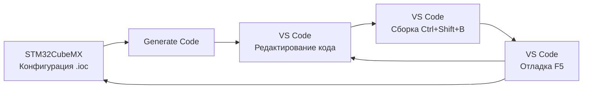

# 🚀 Быстрый старт — F411CE в VS Code

Минимальная инструкция для начала работы с проектом в Visual Studio Code.

---

## ✅ Что уже настроено

- ✅ Конфигурация IntelliSense (`.vscode/c_cpp_properties.json`)
- ✅ Задачи сборки (`.vscode/tasks.json`) с автоматическим PATH
- ✅ Конфигурация отладчика (`.vscode/launch.json`)
- ✅ Обнаружен STM32CubeIDE 1.17.0 в `C:\ST\`
- ✅ Увеличен стек `defaultTask` до 2048 байт в `main.c`

---

## 🔧 Первый запуск (3 шага)

### Шаг 1: Первая сборка в STM32CubeIDE

⚠️ **Обязательно!** Нужно один раз собрать проект в STM32CubeIDE для генерации `Debug/makefile`.

1. Откройте **STM32CubeIDE**
2. File → Open Projects from File System → выберите `F411CE`
3. Project → **Build All** (Ctrl+B)
4. Дождитесь окончания сборки (~30-60 сек)

✅ В папке `Debug/` должны появиться `primGPT_F411.elf` и `makefile`

---

### Шаг 2: Установите расширение Cortex-Debug

Для отладки в VS Code установите расширение:

```bash
code --install-extension marus25.cortex-debug
```

Или через GUI: Extensions (Ctrl+Shift+X) → искать "**Cortex-Debug**" → Install.

---

### Шаг 3: Готово! Начинайте работу

Теперь можно работать полностью в VS Code:

| Действие | Команда |
|----------|---------|
| **Сборка** | `Ctrl+Shift+B` |
| **Прошивка** | `Ctrl+Shift+P` → "Run Task" → "Flash" |
| **Сборка + прошивка** | `Ctrl+Shift+P` → "Run Task" → "Build & Flash" |
| **Отладка** | `F5` (запустит сборку → прошивку → отладку) |

---

## 📝 Основные горячие клавиши

### Редактирование
- `Ctrl+Space` — автодополнение
- `F12` — перейти к определению
- `Shift+F12` — найти все использования
- `F2` — переименовать символ

### Сборка и отладка
- `Ctrl+Shift+B` — сборка
- `F5` — запуск отладки
- `F9` — установить/снять breakpoint
- `F10` — Step Over (следующая строка)
- `F11` — Step Into (войти в функцию)
- `Shift+F5` — остановить отладку

---

## 🔍 Проверка после сборки

После первой сборки в STM32CubeIDE проверьте, что всё работает:

### Тест 1: Сборка в VS Code

```bash
# В терминале VS Code (Ctrl+`)
make -C Debug all
```

Должно пройти успешно без ошибок.

### Тест 2: Проверка размера прошивки

```bash
arm-none-eabi-size Debug/primGPT_F411.elf
```

Ожидаемый вывод:
```
   text    data     bss     dec     hex filename
  48xxx    xxx   xxxxx   xxxxx   xxxxx Debug/primGPT_F411.elf
```

### Тест 3: Прошивка

1. Подключите ST-Link к плате
2. В VS Code: `Ctrl+Shift+P` → "Run Task" → "Flash"
3. Должно завершиться: `** Verified OK **`

---

## 📚 Дополнительная документация

- **[DEBUG_GUIDE.md](DEBUG_GUIDE.md)** — 🐛 полное руководство по отладке с Cortex-Debug (для начинающих)
- **[VSCODE_GUIDE.md](VSCODE_GUIDE.md)** — полное руководство по VS Code (90+ разделов)
- **[CLAUDE.md](CLAUDE.md)** — архитектура проекта для AI-ассистента
- **[STM32CubeIDE.md](STM32CubeIDE.md)** — работа с STM32CubeIDE

---

## ❓ Частые вопросы

### Q: Нужно ли добавлять toolchain в системный PATH?

**A**: Нет! PATH уже настроен в `.vscode/tasks.json`. Сборка через VS Code (Ctrl+Shift+B) работает без дополнительных настроек.

### Q: Можно ли использовать только VS Code, без STM32CubeIDE?

**A**: Почти. STM32CubeIDE нужен только для:
1. Первой генерации `Debug/makefile` (один раз)
2. Изменения конфигурации периферии через CubeMX (`.ioc` файл)

Все остальное (редактирование кода, сборка, отладка) делается в VS Code.

### Q: Как изменить конфигурацию периферии (UART, SPI, GPIO)?

**A**:
1. Откройте `F411CE.ioc` в STM32CubeMX (или STM32CubeIDE)
2. Измените конфигурацию
3. Generate Code
4. Продолжайте работу в VS Code

⚠️ **Важно**: весь ваш код должен быть в блоках `/* USER CODE BEGIN */` ... `/* USER CODE END */`, иначе он будет перезаписан при генерации.

### Q: Как посмотреть логи с USART6 (debug output)?

**A**: Подключите USB-TTL адаптер к USART6:
- **TX (PA11)** → RX адаптера
- **RX (PA12)** → TX адаптера
- **GND** → GND адаптера

Настройки: **115200 8N1**

Используйте любой терминал (PuTTY, RealTerm, CoolTerm).

### Q: Отладчик не останавливается на breakpoint

**A**: Убедитесь, что:
1. Проект собран в Debug конфигурации (`-O0 -g3`)
2. Прошивка актуальная (пересоберите и прошейте)
3. Breakpoint установлен в коде, который реально выполняется

### Q: Ошибка "Error: init mode failed (unable to connect to the target)"

**A**: Проверьте:
1. ST-Link подключен к ПК и плате
2. Плата запитана (3.3V)
3. Установлены драйверы ST-Link
4. ST-Link не занят другой программой (закройте STM32CubeIDE)

---

## 🎯 Workflow: CubeMX + VS Code

Рекомендуемый рабочий процесс:



1. **Конфигурация**: STM32CubeMX (периферия, clock, pins)
2. **Разработка**: VS Code (код, сборка, отладка)
3. **Повторить**: изменения → сборка → тест

---

*Последнее обновление: 2026-02-16*

**Готов к работе!** 🚀 Нажмите `Ctrl+Shift+B` для первой сборки в VS Code.
